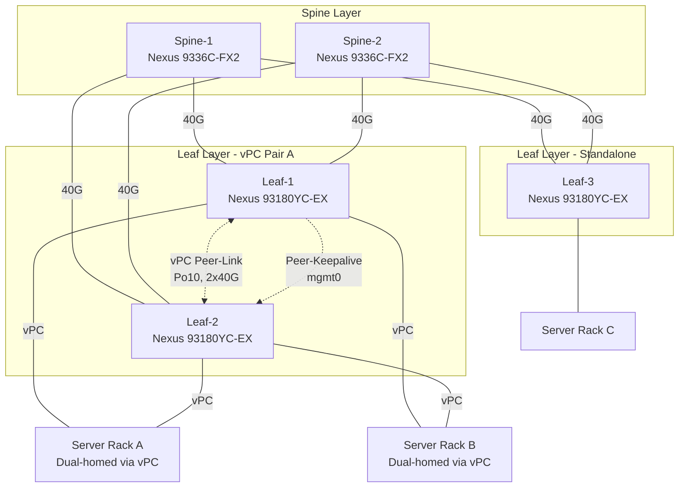

# Topology: 2-Spine / 3-Leaf Data Center Fabric

## Design summary

| Layer | Role | Redundancy model |
|---|---|---|
| Spine | L3 transit only, no server-facing ports | ECMP across both spines via OSPF underlay |
| Leaf (vPC pair) | Server/rack-facing, active-active dual-homing | vPC domain 10, peer-link + peer-keepalive |
| Leaf (standalone) | Lower-redundancy racks / non-critical workloads | Single-homed, relies on spine ECMP only |

- Every leaf connects to **every** spine (full mesh leaf↔spine) — this is what makes it a spine-leaf (Clos) fabric rather than a traditional 3-tier design.
- Spines never connect to each other directly — all spine-to-spine traffic transits through a leaf, which is intentional in a Clos fabric.
- vPC is used at the leaf pair (not the spine) so that dual-homed servers/racks get active-active links with no blocked ports and no STP dependency for the access-facing side.
